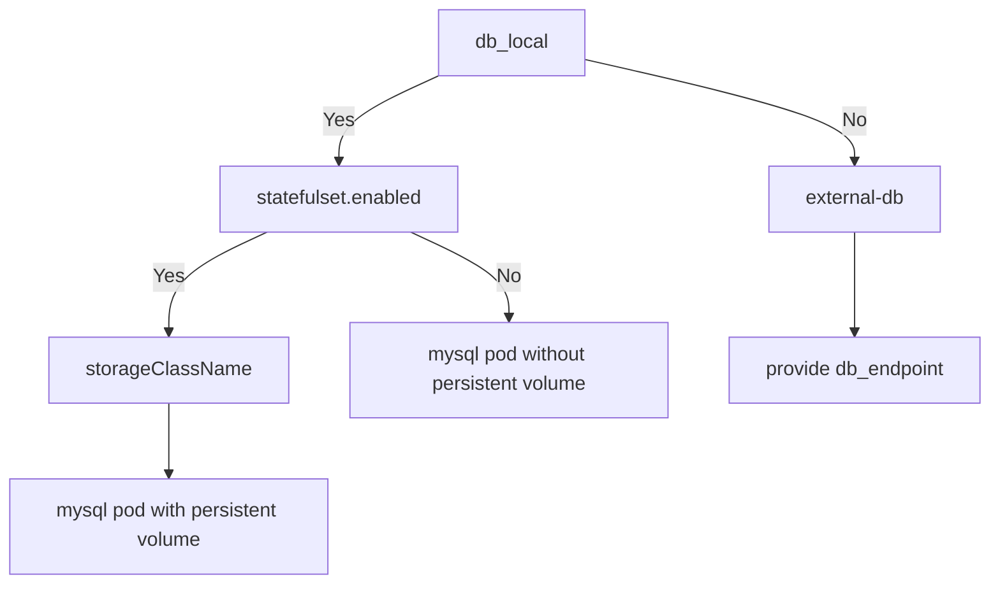
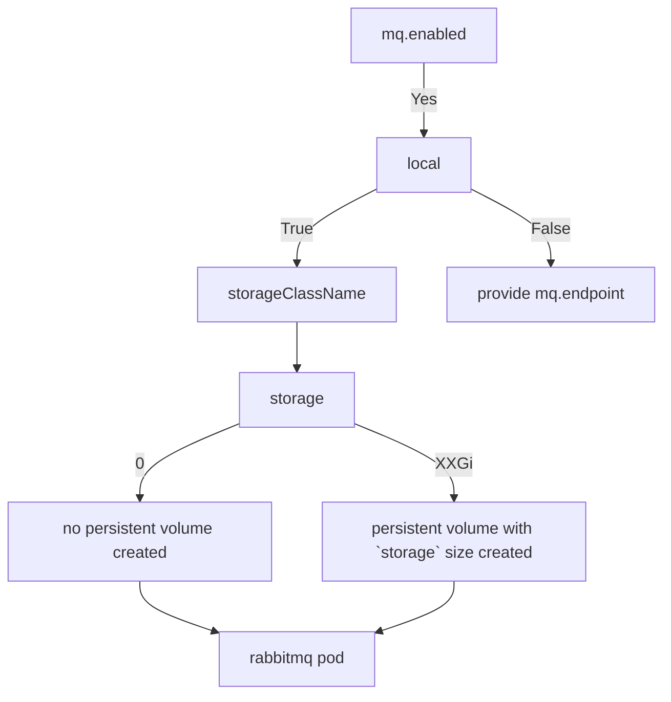
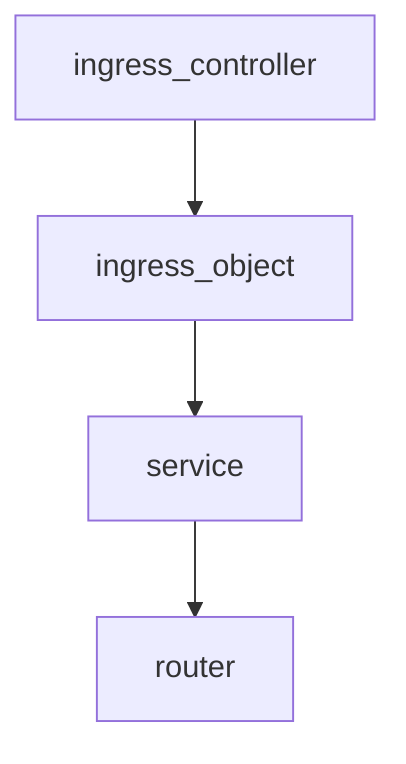
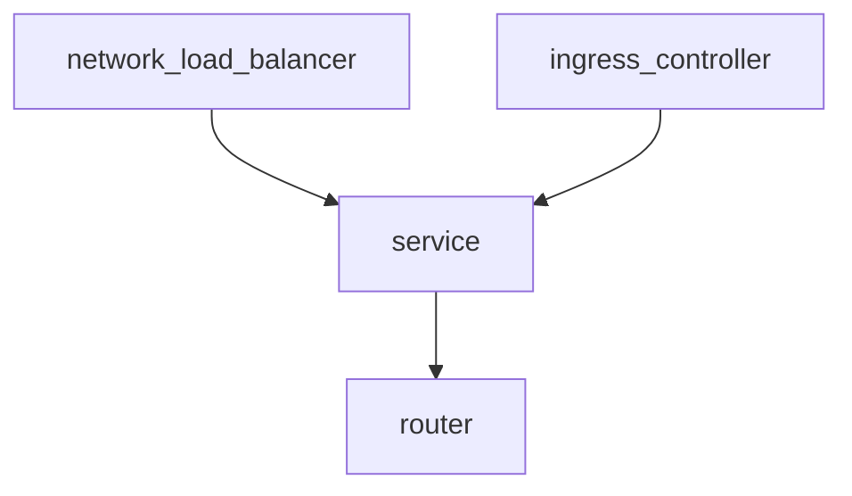
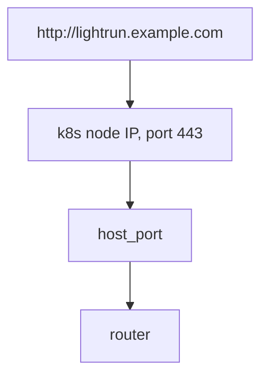
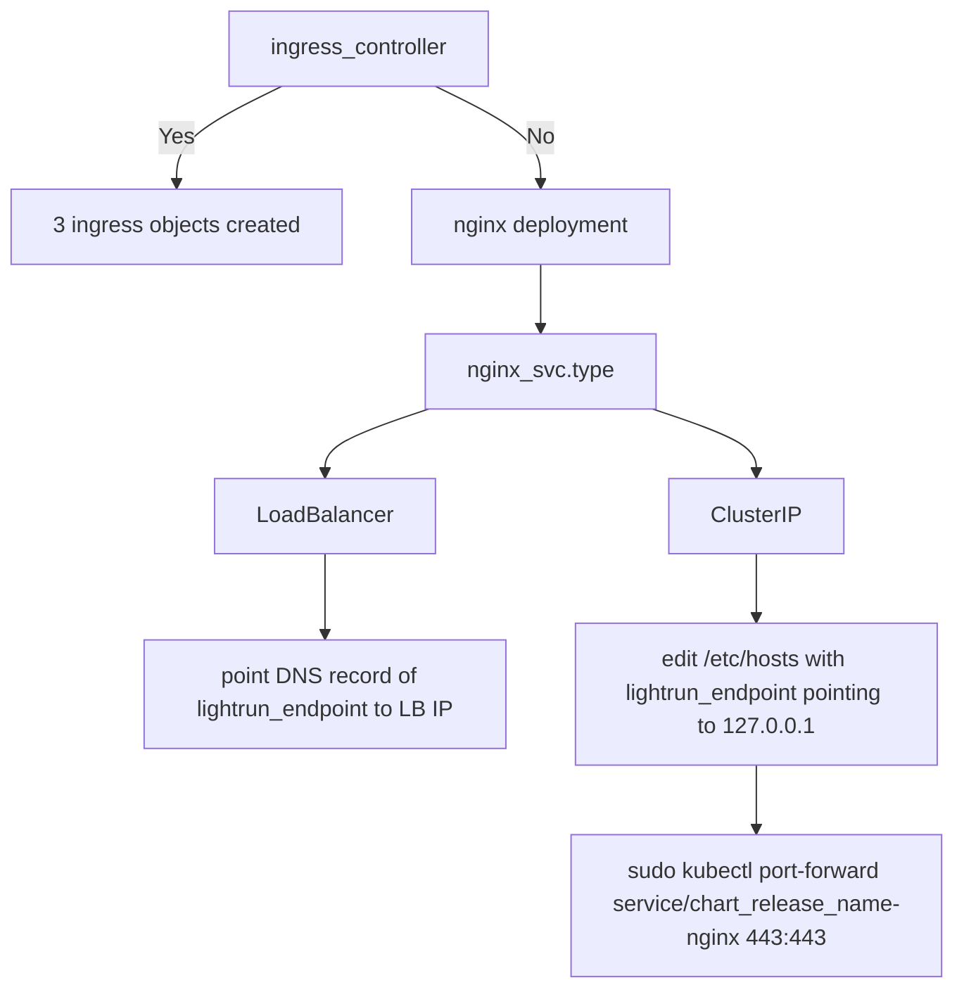
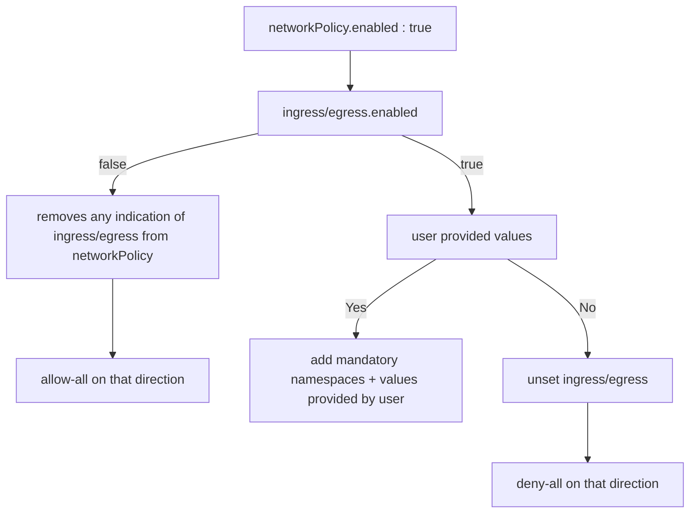
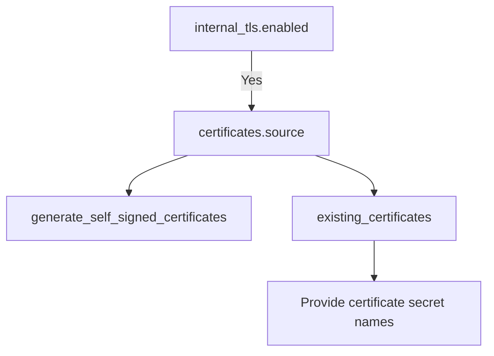

## Main options
---
## DB 
`db_local: true` - if you want to create a new MySQL Server deployment inside k8s, as opposed to connecting to an existing one
`statefulset` - relevant only to local DB in k8s

`db_endpoint` - hostname of external DB  
In case of local DB, `db_endpoint` will be ignored and replaced with the appropriate deployment name



---
## Message Queue
`enabled: false` - Configure backend to use message queue
`local: true` - If true, will create statefulset with `rabbitmq` pod and service
`mq_endpoint` - If `local: false`, provide FQDN  to connect to
`port` - port that will be used to connect to message queue. Default - 5672

#### if `local: false`, all other properties of mq will be ignored
For testing purposes you can create a statefulset without a PVC (PersistentVolumeClaim)  
In this case all data of MQ will be lost on pod restart
```yaml
mq:
  storage: "0"
```
`metrics` - If `true`, Prometheus plugin will be enabled in the RabbitMQ  
Metrics will be exposed via the service on port 15692  
If you want to collect those metrics using Prometheus autodiscovery,
you can provide annotations to that service in the `deployments` part of the values
```yaml
deployments:
  rabbitmq:
    service:
      annotations:
        prometheus.io/scrape: 'true'
        prometheus.io/path: '/metrics'
        prometheus.io/port: '15692'

```


---
## Router
> [!NOTE]
> Dedicated to replace `ingress_controller: true`

In order to support different kind of ingress controllers we need to simplify configuration of the ingress object as much as possible.
To do it we've moved all the routing decisions to new component named router.
Instead of 3 different ingress objects we'll have only 1 that is sending everything to the router.

### Exposure options
Router can be exposed in several ways:
#### 1. Ingress object
When ingress controller do not require additional custom resources of it's own and can work with native ingress object of k8s


#### 2. Service
- When ingress controller require creation of custom resource that is pointing to the service of the router  
  > For example  
  > _`VirtualService` of istio or  `HttpProxy` of contour_  

  In this case we don't need to create the ingress object in the chart, only service  

- Another use case when there is no ingress controller at all and we are using router service with type `LoadBalancer`

#### 3. Host port
Only used in very specific cases, like local cluster (k3s or similar) on the VM. In this case router using ports of the VM itself.
Main use case is to utilize ports 443 and 80 on the VM to serve Lightrun deployment on the common ports.

> [!NOTE]
> In this case we can have only 1 replica and deployment strategy of the router will be `Recreate`  
> `general.router.tls.enabled` should be set to true

---
## Ingress controller

`ingress_controller: true`  
If you have an existing Nginx ingress controller it can be utilized with ingress objects that will be created by this chart. 
Other ingress controllers may also be supported with adjustments to the annotations in [values.yaml](values.yaml#L175).
Alternatively, the chart can be set to install a new Nginx pod as a Load balancer in place of an ingress controller.

`ingress_class_name: nginx`  
Class name of the ingress controller that will be used to forward traffic to the deployment.

If there is no ingress controller (and a new one can't be installed), the chart will create an nginx deployment as a  `LoadBalancer` service. 
For this setup to work k8s has to have some addon or any other way to serve external IP addresses for the load balancer, and to route traffic to it.  
_More explanation may be found here https://www.tkng.io/services/loadbalancer/_
```yaml
  nginx_svc:
    type: LoadBalancer
```
`ClusterIP` also supported for specific use cases, but only if port forwarding will be done on port 443:443.  
`sudo kubectl port-forward service/<chart release name>-nginx 443:443`



---
## Network Policy
***Refer to key `general.networkPolicy` in [values.yaml](values.yaml#L92) for detailed explanation with examples***

`networkPolicy.enabled: false`  
This setting etermines whether network policy should be created as a part of the helm-chart installation.
As stated in official kubernetes documentation https://kubernetes.io/docs/concepts/services-networking/network-policies/#prerequisites,
in order to use this feature, a supported network plugin has to be installed in the cluster.   
Otherwise, the creation of this object will have no effect.

> Note: the network policy applies to all pods within the namespace where the chart is installed.

### General flow control of a particular direction, either ingress or egress would look like:


>mandatory namespaces are:  
> - namspace where the chart is installed
> - kube-system  
>_kube-system is necessary to allow DNS communication. if the internal DNS resides on different namespace then that namespace should be allowed from `values.yaml`_
---
## Internal TLS
By default, pods inside the cluster establish internal connections to each other without SSL encryption enabled, since SSL operations are computationally expensive. 
Therefore SSL is terminated on the client facing loadbalancer.   
In some cases, security policy requires that SSL encryption is used everywhere, including internal communication of the pods.
Usually, such a requirement is handled by service mesh proxies, but in certain cases, it has to be done on the pod level.  
For such cases we have introduced a new key `internal_tls` in [values.yaml](values.yaml#L49) to enable encryption of the communication between the pods (backend -> keycloak, ingress -> frontend, etc).
> Notes:
>  If internal TLS is enabled, we highly recommend to add more resources to allow servers carry out SSL operations 

### How to configure internal TLS
Control flag, setting to true will enable internal TLS  
_default value: `false`_
```yaml
  enabled: true
```
There are 2 options on how to provide certificates to pods:
```yaml
  certificates:
    source: "one of 2 options below"
```

#### `generate_self_signed_certificates` _default option_
Self-signed certificates for all pods (except backend and mysql) will be generated using built-in capabilities of helm. Common Name of certificates will contain service name. Certs are generated for 10 years. using this option will produce secrets of `type: kubernetes.io/tls` per pod's certificate.  
Each secret will include these helm hooks:
```yaml
"helm.sh/hook": "pre-install"
"helm.sh/hook-delete-policy": "before-hook-creation"
```
So that those secrets won't be recreated during `helm upgrade`
> Note for ArgoCD users: 
>
> ArgoCD will still rotate those secrets on the "full sync" operation. This is due to the way ArgoCD works with helm.  
> This, however, will not cause an issue, as pods will not be redeployed on the certificate change.   
> And when you trigger recreation of the pods for any reason, they'll get the new certificates on startup and continue to work as before.


#### `existing_certificates`
you can provide names of the k8s secrets with certificates created outside of this chart to be used for TLS.   
Secrets should contain the following keys: tls.crt, tls.key  

If certificate's SAN has DNS name of all services, it can be reused in all fields  
```yaml
  existing_certificates: 
    frontend: ""
    keycloak: ""
    redis: "" 
    rabbitmq: ""    
    data_streamer: ""
```
> Secrets have to be in the same namespace. 

### Certificate verification
By default pods are configured to verify remote SSL certificate. This can be tuned by the following control flag
```yaml
  verification: true
```
By default the pods will rely on the system's default well-known trusted CAs.  
If you are using private CA, you can provide a secret with the CA certificate that was used to sign all other pods certificates (provided via @param internal_tls.certificates.existing_certificates)  
_This secret should contain the key `ca.crt`_
```yaml
  existing_ca_secret_name: some-ca-secret
```
> Secrets have to be in the same namespace. 


### Ingress configuration
If `ingress_class_name` is  `nginx`, the chart will automatically add an annotation to all ingress objects:
```yaml
nginx.ingress.kubernetes.io/backend-protocol: "HTTPS"
```
If you are using a different ingress controller, you'll need to add appropriate annotations via [ingress values](values.yaml#L364) by yourself, or with the support of your Lightrun Solution Engineer.

Below is a visualized version of internal tls flow control:

---
## Deployments

### Backend
- Amount of memory for `_JAVA_OPTIONS` is calculated from the memory limit of the pod  
- As of Lightrun version 1.14, the backend component requires connectivity to Lightrun's public S3 bucket for access to artifacts related to the IDE plugin.  
  For on-prem servers where access to an external S3 repository is not possible or desired, its use can be disabled with the following flag.  
  When disabled, IDE plugin installation and update will require additional manual intervention - Lightrun's customer support team will provide guidance.
```yaml
deployments:
  backend:
    artifacts:
      enable: false
```

### Keycloak 
- Allow SHA1 algorithm. Since keycloak image is based on RHEL9 where SHA1 has been deprecated. we provided the ability to allow it. a particular case is when using Azure database for MySQL where the certificate sent by azure contain SHA1 algorithm and Keycloak complains about it. the bellow flag control it and by default set to false:
```yaml
  keycloak:
    # Keycloak base image is rehl9 where SHA1 deprecated https://access.redhat.com/articles/6846411.
    # This flag is to re add SHA1 for edge use cases where keycloak works with extenal services
    # that still use SHA1 in their chain. for instance Azure database for MySQL.
    allow_sha1_algorithm: false
```

### SecurityContext
Each deployment has these two parameters in order to control the securityContext:
```yaml
podSecurityContext: {}
containerSecurityContext: {}
```
On pod level - allow users to provide custom SecurityContext. The default is empty, except for the mysql pod which has default mandatory parameter `fsGroup: 10001`.
<br>
<br>
On container level - each deployment has default parameters that cannot be overwritten, those are:
<br>
```yaml
runAsNonRoot: true
seccompProfile:
  type: RuntimeDefault
runAsUser: <custom_per_container>
allowPrivilegeEscalation: false
capabilities:
  drop:
    - "ALL"
```
if `containerSecurityContext: ` is not empty then default values will be merged with containerSecurityContext from values using the following logic:
- non-overlapping fields will be added
- overlapping fields will be preserved from the default values

The purpose is to preserve the User id that will be used by the container for filesystem permissions

### Read Only Root Filesystem:
It is possible to control the mounted root filesystem for frontend, backend, and keycloak containers to be read-only. 
This is done by setting ```general.readOnlyRootFilesystem: true```.


---
## Secrets
If `deploy_secrets: true` - secrets will be deployed as part of this chart.
If you don't want to store secrets in github (Lightrun recommends that you don't), copy `values.yaml` to a local folder and run helm with arguments `-f /path/to/file/values.yaml`  
If `deploy_secrets: false` - chart will not create a secret, but will be looking for the secret with name `{{.Release.name}}-backend`  
> [!WARNING]  
> If you are going to set `deploy_secrets: false` and use secret created outside of the chart, you have to verify that it contains all the mandatory fields specified in the [backend secret](templates/secrets.yaml#L31)

> [!NOTE]  
> You can change name of the secret with the field `existing_secret_name`, which is relevant only if `deploy_secrets: false`  

<br>  

### Defaults

Some secrets are related to Lightrun integrations with various systems. They are configurable under:
```yaml
secrets:
  defaults:
```
<br>  

### Optional fields
There are several fields that are optional and won't be put into the secret and backend env vars in case that values will be left empty 
```yaml
secrets:
  defaults:
    google_sso:
      client_id: ""         # Optional | If empty, will not be used
      client_secret: ""     # Optional | If empty, will not be used
    datadog_api_key:  ""    # Optional | If empty, will not be used
    mixpanel_token: ""      # Optional | If empty, will not be used
    hubspot_token: ""       # Optional | If empty, will not be used
```


### Certificate
Lightrun uses certificates to ensure secure communication between the server and the developer's IDE plugin,
and between the server and the agents which it monitors. There is an option to use existing certificat via esecret of type `kubernetes.io/tls`
```yaml
certificate:
  existing_cert: <name-of-the-secret>
```
Note that **this secret has to be in the same namespace as the chart**  
<br>  

### Deploying secrets outside of this chart
`deploy_secrets: false`  
If you want to generate secrets and create them in k8s outside of this chart, you can copy [secrets.yaml](templates/secrets.yaml)
 and put your own values in the fields that refer to helm values.  
All the other secrets should remain the same.

---

### Values that must be set:

```yaml
general:
  name: "client-name"   
  lightrun_endpoint: "lightrun.example.com"
  db_local: false
  db_endpoint: "mysql.example.com" 
  db_database: lightrunserver
  ingress_controller: true

certificate:
  tls:
    crt: ""
    key: ""
    
secrets: <-- everything here
    
```
For production installation, consider providing more resources to backend/frontend/keycloak deployments.

---
### Redis:

Redis can be either local and deployed as part of chart installation or as external outside the chart.
this is controlled by following configuration:
```yaml
deployments:
  redis:
    external:
      # use external redis instead of local. requires a valid endpoint for redis. compatible with
      # AWS Elasticache and Azure cache for redis.
      enabled: false
      endpoint: "redis.example.com"
```
When redis.external.enabled set to false the chart installs local redis. if set to true 
based on redis.architecture either endpoint or set of endpoints of redis will be used instead.

Architecture 
```yaml
deployments:  
  redis:
    architecture: single # (single|replicated) control the jcache profile passed to backend
```

When redis.architecture = single (default) the backend treats redis as single server.

When redis.archtecture = replicated the backend teart redis as multiple servers.
this option is  only applicable when redis.external.enabled

Also it is mandatory to provide nodeAddresses list when using replicated more as shown below:
```yaml
  redis:
    architecture: replicated # (single|replicated) control the jcache profile passed to backend
    external:
      enabled: true
      replicatedConfig: # an object defines the replicated configuration
        nodeAddresses: [] # MUST have a value if architecture=replicated. otherwise backend won't work. value of FQDNs of reachable nodes
```
