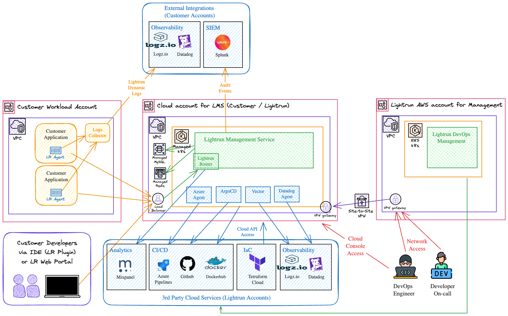

# Lightrun Helm Chart 
The `lightrun` Helm chart provides a reliable and efficient way to deploy and manage Lightrun on Kubernetes. It includes all the essential components for a smooth setup and can scale seamlessly to support large deployments.
## Architecture Overview
### Diagram

### Components

| Component                                           | Description                                                                                                    |
| --------------------------------------------------- | -------------------------------------------------------------------------------------------------------------- |
| [**Router**](docs/components/router/index.md)       | Directs traffic into the cluster.                                                                              |
| [**Frontend**](docs/components/frontend.md)         | Serves the user interface.                                                                                     |
| [**Backend**](docs/components/backend.md)           | Acts as the control plane for Lightrun.                                                                        |
| [**Keycloak**](docs/components/keycloak.md)         | Manages authentication.                                                                                        |
| [**Redis**](docs/components/redis.md)               | Handles caching and pub/sub channels (can be local or external).                                               |
| [**MySQL**](docs/components/database.md)            | Stores application data (can be local or external).                                                            |
| [**RabbitMQ**](docs/components/rabbitmq.md)         | **Optional** Manages the event message queue, primarily for sending telemetry to Lightrun (local or external). |
| [**Datastreamer**](docs/components/datastreamer.md) | **Optional** Sends audit logs to various SIEM systems.                                                         |

## Getting started
### **Quick Start Installation**

If you just want to get Lightrun up and running with default settings, start with our [Quick Start Guide](docs/installation/quickstart.md). This guide covers all the essential steps for a basic installation.

For a **production-ready deployment**, refer to the [**Step-by-Step Planning for Production**](#step-by-step-planning-for-production) section to ensure security, scalability, and best practices.

---
### **Step-by-Step Planning for Production**

To ensure a smooth and secure production deployment of Lightrun, follow these key planning steps:
#### **1. Capacity Planning**

- Assess expected resource usage (CPU, memory, storage) and plan for scalability.
    [More info on Capacity Planning](docs/installation/capacity_planning.md)
#### **2. Compatibility**

- Review the Compatibility matrix for the supported tools.
    [More info on Compatibility](docs/installation/compatibility_matrix.md)
#### **2. Secrets**

- Decide whether to use Helm-managed secrets or an external secrets manager.
    [More info on Secrets Management](docs/installation/secrets.md)

#### **4. System Configuration**

- Obtain the system configuration file and signature from Lightrun.
    [More info on System Configuration](docs/advanced/system_config.md)

#### **5. Lightrun Certificate**

- Plan how Lightrun certificate will be issued and managed for secure communications.
    [More info on Certificate](docs/installation/certificate.md)

#### **6. Database**

> [!TIP]
> Use external database

- Choose between a local or external database.
    [More info on Database Setup](docs/components/database.md)

#### **7. Router**

- Decide how external traffic will reach the Lightrun router (Ingress, Service, OpenShift Route).
    [More info on Router](docs/components/router/index.md)

#### **8. Container Images Registry**

- Choose where to store and manage container images (e.g., private registry, Docker Hub, Azure Container Registry, AWS ECR).
    [More info on Container Image Registry](docs/installation/container_image_registry.md)

#### **9. Redis**
> [!TIP] 
> Use external redis
- Determine if Redis will be local or external.
    [More info on Redis Setup](docs/components/redis.md)

#### **10. (Optional)RabbitMQ**

- Determine if RabbitMQ is needed for sending telemetry to Lightrun.
    [More info on RabbitMQ](docs/components/rabbitmq.md)

#### **11. (Optional)Network Policy**

- Establish network policies to restrict access between services and prevent unauthorized communication.
    [More info on Network Policy](docs/advanced/network_policy.md)

#### **12. (Optional)Internal TLS Communication**

- Decide whether internal TLS is necessary for secure component communication.
    [More info on Internal TLS](docs/advanced/internal_tls.md)

#### **13. Choose Your Deployment Option**

Decide where to run your Kubernetes cluster based on your infrastructure needs. Consider whether you’ll deploy all services locally (including RabbitMQ, Redis, and MySQL) or use managed cloud services.
##### **Supported Kubernetes Platforms:**

Select your preferred cloud provider for deployment:

- **[Azure Kubernetes Service (AKS)](docs/installation/cloud/aks.md)**
- **[Amazon EKS](docs/installation/cloud/eks.md)**
- **[Google Kubernetes Engine (GKE)](docs/installation/cloud/gke.md)**
- **[OpenShift](docs/installation/cloud/openshift.md)**
## Known Issues and Limitations

Review the [Known Limitations](docs/limitations.md) before deployment.

## Release Notes

Check the [versions mapping documentation](docs/installation/versions_mapping.md) for version compatibility.  
Check the [release strategy](docs/release_strategy.md) for the meaning of major minor patch.
See the [changelog](CHANGELOG.md) for a detailed history of changes and improvements in each release.