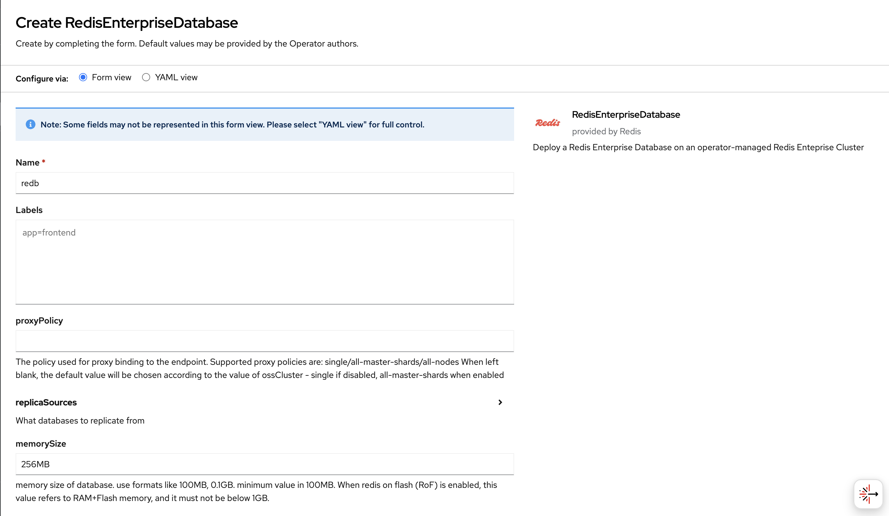
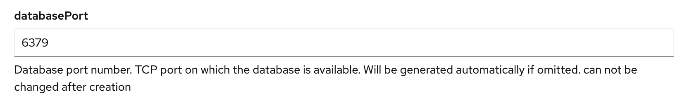
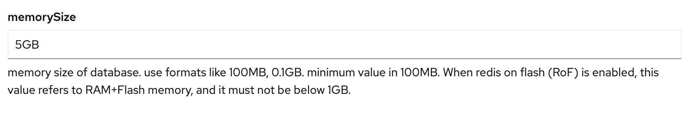
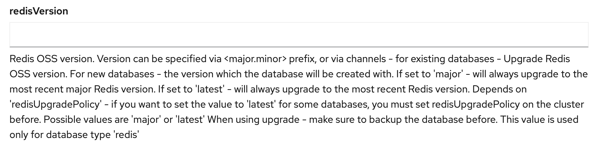

# Integrating Lightrun with Redis Enterprise Operator on OpenShift

This guide explains how to configure the Lightrun Helm chart to work with Redis Enterprise Operator on OpenShift clusters.

## Prerequisites

- OpenShift cluster with Redis Enterprise Operator version 7.8.6-1.1
- Redis Enterprise Database instance created and running with Redis version 7.4.0
- Access to the Redis Enterprise Database credentials

## Configuration Steps

### 1. Configure Redis Enterprise Database

#### 1.1 For UI Users

When creating a Redis Enterprise Database through the OpenShift UI:

1. Navigate to the Installed Operators in the Operators tab
2. Select "RedisEnterpriseDatabase" and click "Create RedisEnterpriseDatabase":

3. Please note that if databasePort is not specified, it will be automatically generated. Ensure that the assigned port matches 6379, as defined in the values.yaml file in Step 3. If you choose a different port, make sure to update it accordingly in the values file.

4. Ensure the memorySize matches 5GB:

5. Ensure the redisVersion aligns the prerequisites defined at the beginning of this document:
   
6. Click "Create" to deploy the Redis Enterprise Database instance.

#### 1.2 For CRD Users

When creating a Redis Enterprise Database using a Custom Resource Definition (CRD), you need to specify at least the following mandatory fields for Lightrun compatibility:

```yaml
apiVersion: app.redislabs.com/v1alpha1
kind: RedisEnterpriseDatabase
metadata:
  name: lightrun-redis
  namespace: redis-enterprise
spec:
  dbName: lightrun-redis
  databasePort: 6379  # Mandatory for Lightrun compatibility
  memorySize: "5GB"
  redisVersion: "" # Ensure the redisVersion aligns the prerequisites defined at the beginning of this document
```

All other values in this CRD are optional and will use defaults if not specified.
Save this as `redis-database.yaml` and apply it with:

```bash
kubectl apply -f redis-database.yaml
```

### 2. Get Redis Database Credentials

First, you need to retrieve the Redis database password from the secret created by Redis Enterprise Operator. The secret is typically named after your Redis Enterprise Database instance.

```bash
# Replace <db-name> with your Redis Enterprise Database name
kubectl get secret <db-name> -n <namespace> -o jsonpath='{.data.password}' | base64 -d
```

### 3. Configure Lightrun Helm Chart Values

When deploying Lightrun using Helm, you need to set the following values to integrate with your Redis Enterprise Database:

```yaml
deployments:
  redis:
    architecture: single
    external:
      enabled: true
      endpoint: <svc_name>.<namespace>.svc.cluster.local
    port: "6379"    
    auth:
      enabled: true

secrets:
  redis:
    password: <your-redis-password>
```

Replace the following placeholders:
- `<svc_name>`: The name of the service created for your Redis Enterprise Database
- `<namespace>`: The namespace where your Redis Enterprise Database is deployed
- `<your-redis-password>`: The password retrieved from the Redis Enterprise Database secret

### 4. Verify Configuration

After applying the configuration, you can verify the connection by checking the Lightrun server logs. You should see successful Redis connection messages in the logs.
```
2025-04-10 10:59:56.665  INFO 1 [] --- [isson-netty-8-2] o.redisson.connection.ConnectionsHolder : 1 connections initialized for redb2.redis-ent-op.svc.cluster.local/172.30.156.161:6379
2025-04-10 10:59:56.681  INFO 1 [] --- [isson-netty-8-1] o.redisson.connection.ConnectionsHolder : 10 connections initialized for redb2.redis-ent-op.svc.cluster.local/172.30.156.161:6379
```

## Notes

- Make sure the Redis Enterprise Database service is accessible from the namespace where Lightrun is deployed
- The Redis endpoint should be in the format `svc_name.namespace.svc.cluster.local`
- Ensure network policies allow communication between Lightrun and Redis if any are in place
