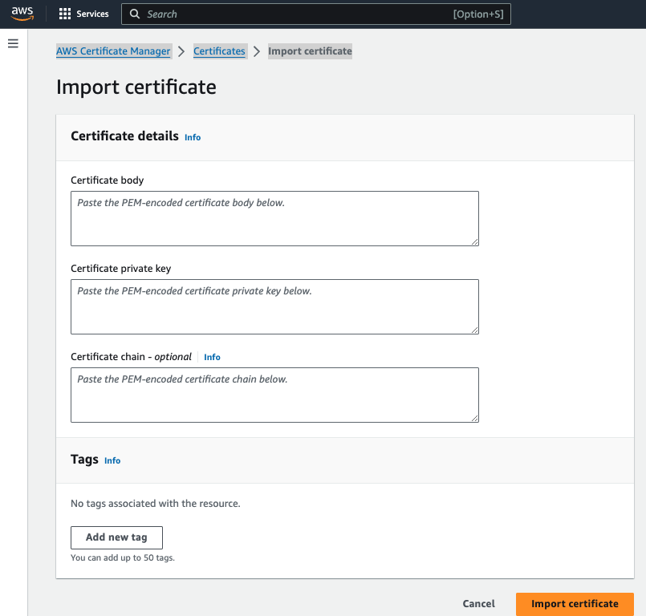
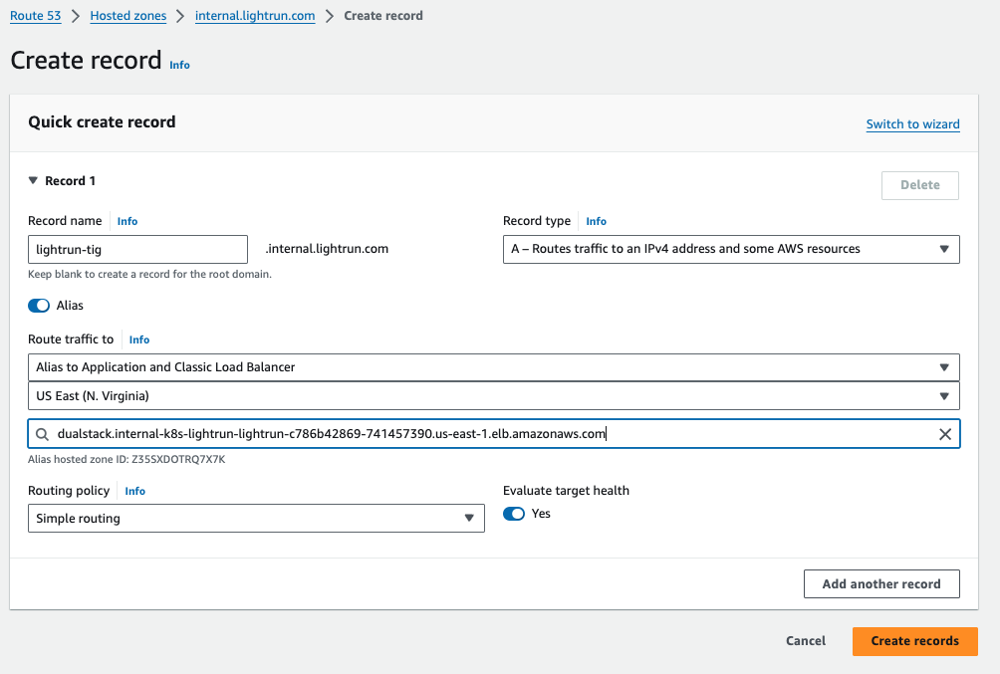
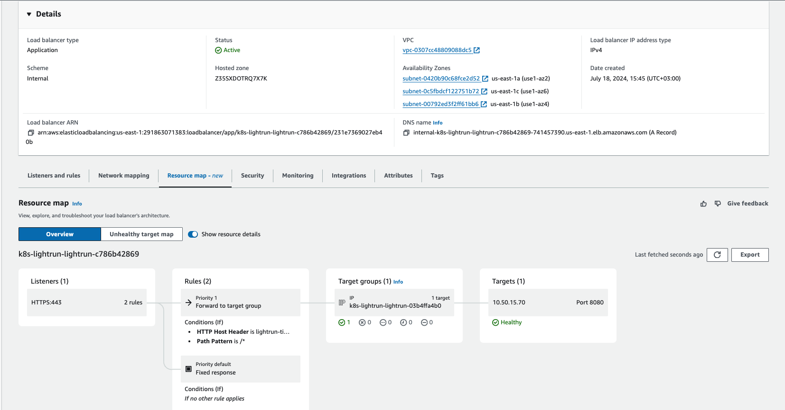

This section configures **Lightrun Router** with the **AWS Load Balancer Controller** (formerly known as AWS ALB ingress controller).
This guide covers provisioning load balancer based on the following options:  
Kubernetes [Ingress resources](https://kubernetes.io/docs/concepts/services-networking/ingress/) by provisioning [Application Load Balancers](https://docs.aws.amazon.com/elasticloadbalancing/latest/application/introduction.html).  
Kubernetes [Service resources](https://kubernetes.io/docs/concepts/services-networking/service/) by provisioning [Network Load Balancers](https://docs.aws.amazon.com/elasticloadbalancing/latest/network/introduction.html).
# Prerequisites
1. When using an application load balancer (instead of network load balancer), a certificate will be served by the ALB load balancer for SSL termination.
2. Ability to create a DNS A record that points to the AWS load balancer record.
3. [AWS load balancer controller installed](https://kubernetes-sigs.github.io/aws-load-balancer-controller/v2.2/deploy/installation/#load-balancer-controller-installation) in the cluster.
# Setup AWS Load Balancer Controller
## Import Certificate To ACM

> [!IMPORTANT]
> Import certificate to ACM is relevant if SSL is enabled for the AWS load balancer.
 
### Using AWS Console

1. Navigate to AWS Certificate Manager > Certificates > Import certificate and fill in the fields:
	1. Certificate body - PEM-encoded certificate body that corresponds to Lightrun endpoint
	2. Certificate private key -  PEM-encoded certificate private key 
	3. [OPTIONAL] Certificate chain - in case intermediate and root CA chain is needed  
	  
   and click Save.

[//]: # (Using Other tools TBD)
## Configure the Lightrun Router in the helm chart
Choose the most suitable option from the list below:  
[1 - AWS Application Load Balancer SSL <> Lightrun Router SSL](#1---aws-application-load-balancer-ssl--lightrun-router-ssl)  
[2 - AWS Application Load Balancer SSL <> Lightrun router Non-SSL](#2---aws-application-load-balancer-ssl--lightrun-router-non-ssl)  
[3 - AWS Network Load Balancer Non-SSL <> Lightrun router SSL](#3---aws-network-load-balancer-non-ssl--lightrun-router-ssl)  
[4 - AWS Network Load Balancer SSL <> Lightrun router SSL](#4---aws-network-load-balancer-ssl--lightrun-router-ssl)  
##### 1 - AWS Application Load Balancer SSL <> Lightrun Router SSL
   >Application load balancer listens on protocol/port HTTPS:443 for incoming requests, performs SSL termination,  and forwards traffic to the Lightrun router on protocol/port HTTPS:8443.  
   > The Lightrun router then performs SSL termination and forwards traffic to Lightrun services inside the cluster.

In the "values.yaml" of the lightrun helm chart navigate to "general.router" and ensure at the minimum the following configuration is set:
* general.router.enabled: true
* general.router.tls.enabled: true
* general.router.ingress.enabled: true
* general.router.ingress.ingress_class_name: "alb" <<< Rename if you've used a custom ingress class name for your AWS Load Balancer Controller.
* general.router.ingress.annotations at the minimum have:
	* `alb.ingress.kubernetes.io/target-type: ip` Remove this annotation if you want to use the default target-type `instance` instead
	* `alb.ingress.kubernetes.io/listen-ports: '[{"HTTPS": 443}]'`
	* `alb.ingress.kubernetes.io/healthcheck-protocol: HTTPS`
	* `alb.ingress.kubernetes.io/backend-protocol: HTTPS`
	* [OPTIONAL] - if you need to control the subnets where LB will be created
		* `alb.ingress.kubernetes.io/subnets: subnet-xxxx, mySubnet`
* general.router.service.enabled: true
* general.router.service.type: ClusterIP
* general.router.host_port.enabled: false  

As shown in the following example:
```yaml
router:  
  ## general.router.enabled - boolean flag, indicates whether to enable a Router (single entrypoint for Lightrun deployment).  
  enabled: true  
  tls:  
    # If enabled router will expose HTTPS traffic  
    # If internal_tls.enabled is set to true, SSL termination will be enabled regardless of this value    # Has to be enabled when exposed by the host_port
    enabled: true  
  
  ingress:  
    enabled: true  
    ingress_class_name: "alb"  
    # If your ingress limiting the body size, you can override it with annotation  
    # example for nginx-ingress: "nginx.ingress.kubernetes.io/proxy-body-size": "25m"
    annotations:  
      alb.ingress.kubernetes.io/target-type: ip  
      alb.ingress.kubernetes.io/listen-ports: '[{"HTTPS": 443}]'  
      alb.ingress.kubernetes.io/healthcheck-protocol: HTTPS  
      alb.ingress.kubernetes.io/backend-protocol: HTTPS  
    labels: {}  
  
  service:  
    enabled: true  
    ## Supported types: ClusterIP, LoadBalancer, NodePort, Headless  
    type: "ClusterIP"  
    annotations: {}  
    labels: {}  
    ports:  
      http: 8080  
      https: 8443  
  
  ## Only relevant for single-vm use case  
  host_port:  
    # Required to set general.router.tls.enabled to true  
    enabled: false  
    ports:  
      http: 80  
      https: 443
```
##### 2 - AWS Application Load Balancer SSL <> Lightrun router Non-SSL
   >Application load balancer listens on protocol/port HTTPS:443 for incoming requests, performs SSL termination and forwards traffic to the Lightrun router on protocol/port HTTP:8080 in a Non-SSL connection.
   >The Lightrun router then forwards traffic to Lightrun services inside the cluster.

In the "values.yaml" of the lightrun helm chart navigate to "general.router" and ensure at the minimum the following configuration is set:
* general.router.enabled: true
* general.router.tls.enabled: false
* general.router.ingress.enabled: true
* general.router.ingress.ingress_class_name: "alb" <<< Rename if you've used a custom ingress class name for your AWS Load Balancer Controller.
* general.router.ingress.annotations at the minimum have:
	* `alb.ingress.kubernetes.io/target-type: ip` Remove this annotation if you want to use the default target-type `instance` instead
	* `alb.ingress.kubernetes.io/listen-ports: '[{"HTTPS": 443}]'`
	* `alb.ingress.kubernetes.io/healthcheck-protocol: HTTP`
	* `alb.ingress.kubernetes.io/backend-protocol: HTTP`
	* [OPTIONAL] - if you need to control the subnets where LB will be created
		* `alb.ingress.kubernetes.io/subnets: subnet-xxxx, mySubnet`
* general.router.service.enabled: true
* general.router.service.type: ClusterIP
* general.router.host_port.enabled: false  

As shown in the following example:
```yaml
router:  
  ## general.router.enabled - boolean flag, indicates whether to enable a Router (single entrypoint for Lightrun deployment).  
  enabled: true  
  tls:  
    # If enabled router will expose HTTPS traffic  
    # If internal_tls.enabled is set to true, SSL termination will be enabled regardless of this value    # Has to be enabled when exposed by the host_port
    enabled: false  
  
  ingress:  
    enabled: true  
    ingress_class_name: "alb"
    # If your ingress limiting the body size, you can override it with annotation  
    # example for nginx-ingress: "nginx.ingress.kubernetes.io/proxy-body-size": "25m"
    annotations:  
      alb.ingress.kubernetes.io/target-type: ip  
      alb.ingress.kubernetes.io/listen-ports: '[{"HTTPS": 443}]'  
      alb.ingress.kubernetes.io/healthcheck-protocol: HTTP  
      alb.ingress.kubernetes.io/backend-protocol: HTTP  
    labels: {}  
  
  service:  
    enabled: true  
    ## Supported types: ClusterIP, LoadBalancer, NodePort, Headless  
    type: "ClusterIP"  
    annotations: {}  
    labels: {}  
    ports:  
      http: 8080  
      https: 8443  
  
  ## Only relevant for single-vm use case  
  host_port:  
    # Required to set general.router.tls.enabled to true  
    enabled: false  
    ports:  
      http: 80  
      https: 443
```
##### 3 - AWS Network Load Balancer Non-SSL <> Lightrun router SSL
   >Network load balancer listens on protocol/port TCP:443 for incoming requests and forwards traffic to the Lightrun router listen on protocol/port HTTPS:8443.
   >The Lightrun router then performs SSL termination and forwards traffic to Lightrun services inside the cluster.

In the "values.yaml" of the lightrun helm chart navigate to "general.router" and ensure at the minimum the following configuration is set:
* general.router.enabled: true
* general.router.tls.enabled: false
* general.router.ingress.enabled: false
* general.router.service.enabled: true
* general.router.service.type: LoadBalancer
* general.router.service.ports.https: 443 <<< This is important as it controls the listener on the nlb
* general.router.service.annotations at the minimum have:
	* `service.beta.kubernetes.io/aws-load-balancer-type: external`
	* `service.beta.kubernetes.io/aws-load-balancer-nlb-target-type: ip`
	* [OPTIONAL] - in case you need to control the subnets where LB will be created
		* `service.beta.kubernetes.io/aws-load-balancer-subnets: subnet-xxxx, mySubnet`
* general.router.host_port.enabled: false  

As shown in the following example:
```yaml
router:  
  ## general.router.enabled - boolean flag, indicates whether to enable a Router (single entrypoint for Lightrun deployment).  
  enabled: true  
  tls:  
    # If enabled router will expose HTTPS traffic  
    # If internal_tls.enabled is set to true, SSL termination will be enabled regardless of this value    # Has to be enabled when exposed by the host_port
    enabled: true  
  
  ingress:  
    enabled: false  
    ingress_class_name: ""  
    # If your ingress limiting the body size, you can override it with annotation  
    # example for nginx-ingress: "nginx.ingress.kubernetes.io/proxy-body-size": "25m"
    annotations: {}  
    labels: {}  
  
  service:  
    enabled: true  
    ## Supported types: ClusterIP, LoadBalancer, NodePort, Headless  
    type: "LoadBalancer"  
    annotations:  
      service.beta.kubernetes.io/aws-load-balancer-type: external  
      service.beta.kubernetes.io/aws-load-balancer-nlb-target-type: ip  
    labels: {}  
    ports:  
      http: 8080  
      https: 443  
  
  ## Only relevant for single-vm use case  
  host_port:  
    # Required to set general.router.tls.enabled to true  
    enabled: false  
    ports:  
      http: 80  
      https: 443
```
##### 4 - AWS Network Load Balancer SSL <> Lightrun router SSL
   >Network load balancer listens on protocol/port SSL:443 for incoming requests, performs SSL termination, and forwards traffic to the Lightrun router on protocol/port HTTPS:8443, 
   >The Lightrun router then performs SSL termination and forwards traffic to Lightrun services inside the cluster.

In the "values.yaml" of the lightrun helm chart navigate to "general.router" and ensure at the minimum the following configuration is set:
* general.router.enabled: true
* general.router.tls.enabled: true
* general.router.ingress.enabled: false
* general.router.service.enabled: true
* general.router.service.type: LoadBalancer
* general.router.service.ports.https: 443 <<< This is important as it controls the listener on the nlb
* general.router.service.annotations at the minimum have:
	* `service.beta.kubernetes.io/aws-load-balancer-type: external`
	* `service.beta.kubernetes.io/aws-load-balancer-nlb-target-type: ip`
	* `service.beta.kubernetes.io/aws-load-balancer-ssl-cert:: arn:aws:acm:us-west-2:xxxxx:certificate/xxxxxxx` <<< You will need to replace the value with a proper arn of the certificate in AWS. the one that was imported to ACM.
	* `service.beta.kubernetes.io/aws-load-balancer-ssl-ports: "443"`
	* `service.beta.kubernetes.io/aws-load-balancer-backend-protocol: ssl`
	* [OPTIONAL] - in case you need to control the subnets where LB will be created
		* `service.beta.kubernetes.io/aws-load-balancer-subnets: subnet-xxxx, mySubnet`
* general.router.host_port.enabled: false  

As shown in the following example:
```yaml
router:  
  ## general.router.enabled - boolean flag, indicates whether to enable a Router (single entrypoint for Lightrun deployment).  
  enabled: true  
  tls:  
    # If enabled router will expose HTTPS traffic  
    # If internal_tls.enabled is set to true, SSL termination will be enabled regardless of this value    # Has to be enabled when exposed by the host_port
    enabled: true  
  
  ingress:  
    enabled: false  
    ingress_class_name: ""  
    # If your ingress limiting the body size, you can override it with annotation  
    # example for nginx-ingress: "nginx.ingress.kubernetes.io/proxy-body-size": "25m"
    annotations: {}  
    labels: {}  
  
  service:  
    enabled: true  
    ## Supported types: ClusterIP, LoadBalancer, NodePort, Headless  
    type: "LoadBalancer"  
    annotations:  
      service.beta.kubernetes.io/aws-load-balancer-type: external  
      service.beta.kubernetes.io/aws-load-balancer-nlb-target-type: ip  
      service.beta.kubernetes.io/aws-load-balancer-ssl-cert: "arn:aws:acm:us-west-2:xxxxx:certificate/xxxxxxx"  
      service.beta.kubernetes.io/aws-load-balancer-ssl-ports: "443"  
      service.beta.kubernetes.io/aws-load-balancer-backend-protocol: ssl
    labels: {}  
    ports:  
      http: 8080  
      https: 443  
  
  ## Only relevant for single-vm use case  
  host_port:  
    # Required to set general.router.tls.enabled to true  
    enabled: false  
    ports:  
      http: 80  
      https: 443  
```


## Create a DNS record pointing to external alb 
1. fetch the alb address by running - ` kubectl get ingress -n <lightrun_namespace>` for example: 
	```
	NAME                                  CLASS   HOSTS                                ADDRESS                                                                           PORTS     AGE
	lightrun-onprem-tig-router-ingress   alb     lightrun-tig.internal.lightrun.com   internal-k8s-lightrun-lightrun-c786b42869-741457390.us-east-1.elb.amazonaws.com   80, 443   2m59s
	
	```
	If you don't see an ADDRESS it could be that the AWS Load Balancer Controller was not able to provision the load balancer on AWS, to investigate it further you may inspect the logs of the AWS Load Balancer Controller pod. it could be improper permissions.
2. based on your DNS provider, create a DNS A record with the same record name as the HOST from the above output in this example "lightrun-tig.internal.lightrun.com"  with the ADDRESS from the above output in this example "internal-k8s-lightrun-lightrun-c786b42869-741457390.us-east-1.elb.amazonaws.com". below is an example of a Route53 :  
   


# Verification
## Verify Lightrun router pod is up:
1. run `kubectl get pods -n <lightrun_namespace>` and check the status of the lightrun router pod
	```
	NAME                                            READY   STATUS    RESTARTS   AGE
	lightrun-onprem-tig-backend-df6677d58-nmkwj     1/1     Running   0          9m40s
	lightrun-onprem-tig-frontend-6bc68bf77-2zw4j    1/1     Running   0          12m
	lightrun-onprem-tig-router-7786fb5f4d-qf876     1/1     Running   0          12m
	lightrun-onprem-tig-keycloak-67974bd8dd-mwpvh   1/1     Running   0          9m49s
	lightrun-onprem-tig-redis-54ccf9bf77-nkxw6      1/1     Running   0          12m
	
	```
2. When using ALB, check the status by navigating in the AWS Console to EC2 > Load balancers > and expand the newly created alb load balancer. Go to resource map and confirm that the listen port is set to HTTPS:443 and that the target IP matches the IP address of the gateway pod as shown below:
   
# References
* [AWS Load Balancer Controller Official Documentation](https://kubernetes-sigs.github.io/aws-load-balancer-controller/v2.8/)
