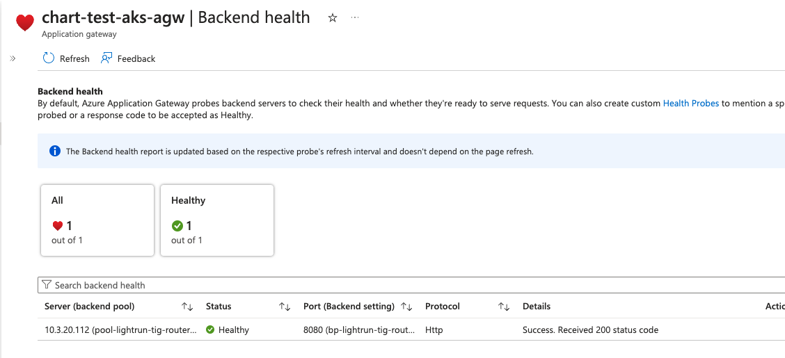

This section configures **Lightrun Router** with the  **Azure Application Gateway Ingress Controller**.
This guide covers [Azure Application Gateways](https://azure.microsoft.com/en-us/services/application-gateway/) based on Kubernetes [Ingress resources](https://kubernetes.io/docs/concepts/services-networking/ingress/).
# Prerequisites
1. A certificate that is provided by the customer as part of Lightrun helm chat. the same certificate will be used by Azure Application Gateway for SSL termination.
2. Ability to create DNS A record points to the Azure Application Gateway record.
3. [Azure Application Gateway Ingress Controller installed](https://learn.microsoft.com/en-us/azure/application-gateway/ingress-controller-overview) in the cluster.
# Configure the Lightrun Router in the helm chart
Choose the most suitable option from the list below:  
[1 - Azure Application Gateway  SSL <> Lightrun Router SSL](#1-azure-application-gateway-ssl-lightrun-router-ssl)  
[2 - Azure Application Gateway SSL <> Lightrun Router Non-SSL](#2-azure-application-gateway-ssl-lightrun-router-non-ssl)
##### 1 - Azure Application Gateway  SSL <> Lightrun Router SSL
   >The Application Gateway listens for incoming requests on protocol/port HTTPS:443, performs SSL termination, and forwards the traffic to the Lightrun Router on protocol/port HTTPS:8443.  
   >The Lightrun Router then performs SSL termination and directs the traffic to Lightrun services within the cluster.

In the "values.yaml" of the lightrun helm chart navigate to "general.router" and ensure at the minimum the following configuration is set:
* general.router.enabled: true
* general.router.tls.enabled: true
* general.router.ingress.enabled: true
* general.router.ingress.ingress_class_name: "azure-application-gateway"
* general.router.ingress.annotations at the minimum have:
	* `appgw.ingress.kubernetes.io/backend-protocol: "https"`
* general.router.service.enabled: true
* general.router.service.type: ClusterIP
* general.router.host_port.enabled: false  

As shown in the following example:
```yaml
router:  
  ## general.router.enabled - boolean flag, indicates whether to enable a Router (single entrypoint for Lightrun deployment).  
  enabled: true  
  tls:  
    # If enabled router will expose HTTPS traffic  
    # If internal_tls.enabled is set to true, SSL termination will be enabled regardless of this value    # Has to be enabled when exposed by the host_port
    enabled: true  
  
  ingress:  
    enabled: true  
    ingress_class_name: "azure-application-gateway"  
    # If your ingress limiting the body size, you can override it with annotation  
    # example for nginx-ingress: "nginx.ingress.kubernetes.io/proxy-body-size": "50m"
    annotations:  
      appgw.ingress.kubernetes.io/backend-protocol: "https" 
    labels: {}  
  
  service:  
    enabled: true  
    ## Supported types: ClusterIP, LoadBalancer, NodePort, Headless  
    type: "ClusterIP"  
    annotations: {}  
    labels: {}  
    ports:  
      http: 8080  
      https: 8443  
  
  ## Only relevant for single-vm use case  
  host_port:  
    # Required to set general.router.tls.enabled to true  
    enabled: false  
    ports:  
      http: 80  
      https: 443
```
##### 2 - Azure Application Gateway SSL <> Lightrun Router Non-SSL
  >The Azure Application Gateway listens for incoming requests on protocol/port HTTPS:443, performs SSL termination, and forwards the traffic to the Lightrun Router on protocol/port HTTP:8080 as a non-SSL connection.  
  >The Lightrun Router then directs the traffic to Lightrun services within the cluster.

In the "values.yaml" of the lightrun helm chart navigate to "general.router" and ensure at the minimum the following configuration is set:
* general.router.enabled: true
* general.router.tls.enabled: false
* general.router.ingress.enabled: true
* general.router.ingress.ingress_class_name: "azure-application-gateway"
* general.router.service.enabled: true
* general.router.service.type: ClusterIP
* general.router.host_port.enabled: false  

As shown in the following example:
```yaml
router:  
  ## general.router.enabled - boolean flag, indicates whether to enable a Router (single entrypoint for Lightrun deployment).  
  enabled: true  
  tls:  
    # If enabled router will expose HTTPS traffic  
    # If internal_tls.enabled is set to true, SSL termination will be enabled regardless of this value    # Has to be enabled when exposed by the host_port
    enabled: false  
  
  ingress:  
    enabled: true  
    ingress_class_name: "azure-application-gateway"  
    # If your ingress limiting the body size, you can override it with annotation  
    # example for nginx-ingress: "nginx.ingress.kubernetes.io/proxy-body-size": "50m"
    annotations: {}
    labels: {}  
  
  service:  
    enabled: true  
    ## Supported types: ClusterIP, LoadBalancer, NodePort, Headless  
    type: "ClusterIP"  
    annotations: {}  
    labels: {}  
    ports:  
      http: 8080  
      https: 8443  
  
  ## Only relevant for single-vm use case  
  host_port:  
    # Required to set general.router.tls.enabled to true  
    enabled: false  
    ports:  
      http: 80  
      https: 443
```

# Create a DNS record pointing to Azure Application Gateway 

1. fetch the Application Gateway address by running - ` kubectl get ingress -n <lightrun_namespace>` for example: 
	```
	NAME                                     CLASS                       HOSTS                                             ADDRESS        PORTS     AGE
	lightrun-tig-router-azure-3-6-0-router   azure-application-gateway   lightrun-tig-router-azure.internal.lightrun.com   4.182.198.76   80, 443   19h
	```
 
   If you don't see an ADDRESS, it may be because the Azure Application Gateway Ingress Controller couldn't configure the Application Gateway on Azure. 
   To investigate further, you can inspect the logs of the Azure Application Gateway Ingress Controller pod.

2. Based on your DNS provider, create a DNS A record with the record name matching the HOST from the above output (e.g., "lightrun-tig-router-azure.internal.lightrun.com") and set it to the ADDRESS provided in the output (e.g., "4.182.198.76").

# Verification
## Verify Lightrun Router pod is up:

1. run `kubectl get pods -n <lightrun_namespace>` and check the status of the lightrun router pod
	```
	NAME                                                        READY   STATUS    RESTARTS      AGE
	lightrun-tig-router-azure-3-6-0-backend-77669554d5-vwssb    1/1     Running   0             19h
	lightrun-tig-router-azure-3-6-0-frontend-5b989584f8-4x4l4   1/1     Running   0             19h
	lightrun-tig-router-azure-3-6-0-keycloak-65998c7bb7-9t4cv   1/1     Running   0             19h
	lightrun-tig-router-azure-3-6-0-mysql-0                     1/1     Running   0             19h
	lightrun-tig-router-azure-3-6-0-redis-67886ff869-zp5ls      1/1     Running   0             19h
	lightrun-tig-router-azure-3-6-0-router-699dd99bbf-kkwlr     1/1     Running   0             22m
	
	```
 
2. On Azure portal check the backend healthcheck:  
