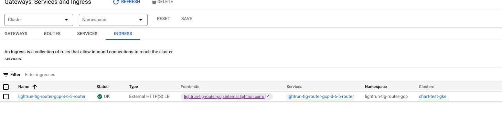

This section configures **Lightrun Router** with the **GKE  Ingress Controller**.
This guide covers set either  [External Application Load Balancer](https://cloud.google.com/load-balancing/docs/https) or [Internal Application Load Balancer](https://cloud.google.com/load-balancing/docs/l7-internal) based on Kubernetes [Ingress resources](https://kubernetes.io/docs/concepts/services-networking/ingress/).
# Prerequisites
1. A certificate that is provided as part of the Lightrun helm chat. the same certificate will be used by the GCP Application Load Balancer for SSL termination.
2. To use Ingress, you must have the HTTP load balancing add-on enabled. GKE clusters have HTTP load balancing enabled by default; you must not disable it.
3. Ability to create DNS A record points to the GCP Application Load Balancer record.
# Caution
Based on the [official documentation GKE Ingress Controller](https://cloud.google.com/kubernetes-engine/docs/concepts/ingress) there are several points to take into account:
1. Although the `kubernetes.io/ingress.class` annotation is [deprecated in Kubernetes](https://kubernetes.io/docs/concepts/services-networking/ingress/#deprecated-annotation), GKE continues to use this annotation.  You cannot use the `ingressClassName` field to specify a GKE Ingress. You must use the `kubernetes.io/ingress.class` annotation.
2. For clusters running GKE versions 1.18 and later, whether or not the GKE Ingress controller processes an Ingress depends on the value of the `kubernetes.io/ingress.class` annotation:
  
    
    | `kubernetes.io/ingress.class` value                  | `ingressClassName` value                  | GKE Ingress controller behavior                                                                 |
    |------------------------------------------------------|-------------------------------------------|--------------------------------------------------------------------------------------------------|
    | Not set                                              | Not set                                   | Processes the Ingress manifest and creates an external Application Load Balancer.                   |
    | Not set                                              | Any value                                 | Takes no action. The Ingress manifest could be processed by a third-party Ingress controller if one has been deployed. |
    | `gce`                                                | Any value. This field is ignored.         | Processes the Ingress manifest and creates an external Application Load Balancer.                   |
    | `gce-internal`                                       | Any value. This field is ignored.         | Processes the Ingress manifest and creates an internal Application Load Balancer.                   |
    | Set to a value other than `gce` or `gce-internal`    | Any value                                 | Takes no action. The Ingress manifest could be processed by a third-party Ingress controller if one has been deployed. |

    For clusters running older GKE versions, the GKE controller processes any Ingress that does not have the annotation kubernetes.io/ingress.class, or has the annotation with the value gce or gce-internal.
3. GKE use so-called Container-native load balancing which is a practice of load balancing directly to Pod endpoints in GKE using [Network Endpoint Groups (NEGs)](https://cloud.google.com/load-balancing/docs/negs).
   Container-native load balancing is enabled by default for Services when all of the following conditions are met:

	- For Services created in GKE clusters 1.17.6-gke.7 and up
	- Using VPC-native clusters
	- Not using a Shared VPC
	- Not using GKE Network Policy

	Under these conditions, Services will be annotated automatically with `cloud.google.com/neg: '{"ingress": true}'` indicating that a NEG should be created to mirror the Pod IPs within the Service. The NEG is what allows Compute Engine load balancers to communicate directly with Pods. Note that existing Services created prior to GKE 1.17.6-gke.7 won't be automatically annotated by the Service controller.  
	The most important note to take here is that it might take time for GCP to complete the provisioning of the required resources and you can monitor it through the ingress object on GCP Console. 

# Configure the Lightrun Router in the helm chart
Choose the most suitable option from the list below:  
[1 - GCP Application Load Balancer  SSL <> Lightrun Router SSL](#1-gcp-application-load-balancer-ssl-lightrun-router-ssl)  
[2 - GCP Application Load Balancer SSL <> Lightrun Router Non-SSL](#2-gcp-application-load-balancer-ssl-lightrun-router-non-ssl)
##### 1 - GCP Application Load Balancer  SSL <> Lightrun Router SSL
   >The GCP Application Load Balancer listens for incoming requests on protocol/port HTTPS:443, performs SSL termination, and forwards the traffic to the Lightrun Router on protocol/port HTTPS:8443.  
   >The Lightrun Router then performs SSL termination and directs the traffic to Lightrun services within the cluster.

In the "values.yaml" of the lightrun helm chart navigate to "general.router" and ensure at the minimum the following configuration is set:
* general.router.enabled: true
* general.router.tls.enabled: true
* general.router.ingress.enabled: true
* general.router.ingress.ingress_class_name: ""
* general.router.ingress.annotations at the minimum have:
	* `kubernetes.io/ingress.class: "gce"`
* general.router.service.enabled: true
* general.router.service.type: ClusterIP
* general.router.service.annotations at the minimum have:
	* `cloud.google.com/app-protocols: '{"https":"HTTPS"}'`
* general.router.host_port.enabled: false  

As shown in the following example:
```yaml
router:  
  ## general.router.enabled - boolean flag, indicates whether to enable a Router (single entrypoint for Lightrun deployment).  
  enabled: true  
  tls:  
    # If enabled router will expose HTTPS traffic  
    # If internal_tls.enabled is set to true, SSL termination will be enabled regardless of this value    # Has to be enabled when exposed by the host_port
    enabled: true  
  
  ingress:  
    enabled: true  
    ingress_class_name: ""  
    # If your ingress limiting the body size, you can override it with annotation  
    # example for nginx-ingress: "nginx.ingress.kubernetes.io/proxy-body-size": "50m"
    annotations:  
      kubernetes.io/ingress.class: "gce" 
    labels: {}  
  
  service:  
    enabled: true  
    ## Supported types: ClusterIP, LoadBalancer, NodePort, Headless  
    type: "ClusterIP"  
    annotations:
      cloud.google.com/app-protocols: '{"https":"HTTPS"}'  
    labels: {}  
    ports:  
      http: 8080  
      https: 8443  
  
  ## Only relevant for single-vm use case  
  host_port:  
    # Required to set general.router.tls.enabled to true  
    enabled: false  
    ports:  
      http: 80  
      https: 443
```
##### 2 - GCP Application Load Balancer SSL <> Lightrun Router Non-SSL
  >The GCP Application Load Balancer listens for incoming requests on protocol/port HTTPS:443, performs SSL termination, and forwards the traffic to the Lightrun Router on protocol/port HTTP:8080 as a non-SSL connection.  
  >The Lightrun Router then directs the traffic to Lightrun services within the cluster.

In the "values.yaml" of the lightrun helm chart navigate to "general.router" and ensure at the minimum the following configuration is set:
* general.router.enabled: true
* general.router.tls.enabled: false
* general.router.ingress.enabled: true
* general.router.ingress.ingress_class_name: ""
* general.router.ingress.annotations at the minimum have:
	* `kubernetes.io/ingress.class: "gce"`
* general.router.service.enabled: true
* general.router.service.type: ClusterIP
* general.router.host_port.enabled: false  

As shown in the following example:
```yaml
router:  
  ## general.router.enabled - boolean flag, indicates whether to enable a Router (single entrypoint for Lightrun deployment).  
  enabled: true  
  tls:  
    # If enabled router will expose HTTPS traffic  
    # If internal_tls.enabled is set to true, SSL termination will be enabled regardless of this value    # Has to be enabled when exposed by the host_port
    enabled: false  
  
  ingress:  
    enabled: true  
    ingress_class_name: ""  
    # If your ingress limiting the body size, you can override it with annotation  
    # example for nginx-ingress: "nginx.ingress.kubernetes.io/proxy-body-size": "50m"
    annotations:
      kubernetes.io/ingress.class: "gce"
    labels: {}  
  
  service:  
    enabled: true  
    ## Supported types: ClusterIP, LoadBalancer, NodePort, Headless  
    type: "ClusterIP"  
    annotations: {}  
    labels: {}  
    ports:  
      http: 8080  
      https: 8443  
  
  ## Only relevant for single-vm use case  
  host_port:  
    # Required to set general.router.tls.enabled to true  
    enabled: false  
    ports:  
      http: 80  
      https: 443
```

# Create a DNS record pointing to GCP Application Load Balancer

1. fetch the GCP Application Load Balancer address by running - ` kubectl get ingress -n <lightrun_namespace>` for example: 
	```
    NAME                                   CLASS    HOSTS                                           ADDRESS         PORTS     AGE
    lightrun-tig-router-gcp-3-6-5-router   <none>   lightrun-tig-router-gcp.internal.lightrun.com   34.54.170.204   80, 443   64m
	```
 
   If you don't see an ADDRESS, it may be because the GCP Ingress Controller couldn't configure the Application Load Balancer on GCP. 
   To investigate further, you can inspect the logs and events of the Lightrun Router Ingress object on the GCP console.

2. Based on your DNS provider, create a DNS A record with the record name matching the HOST from the above output (e.g., "lightrun-tig-router-gcp.internal.lightrun.com") and set it to the ADDRESS provided in the output (e.g., "34.54.170.204").

# Verification
## Verify Lightrun Router get requests from GCP Application Load Balancer:

1. Run `kubectl get pods -n <lightrun_namespace>` and fetch the name lightrun router pod.
	```
	lightrun-tig-backend-8b7d546d7-7n2nc     1/1     Running   0          85m
	lightrun-tig-frontend-574b8f7b74-nf6ps   1/1     Running   0          85m
	lightrun-tig-keycloak-79bb8d9686-zb87z   1/1     Running   0          85m
	lightrun-tig-mysql-0                     1/1     Running   0          85m
	lightrun-tig-redis-9cb6877-49vpt         1/1     Running   0          85m
	lightrun-tig-router-65cb8ddf58-slsxn     1/1     Running   0          85m
	
	```

2. Run `kubectl logs <name of the router pod from point 1 above> -n <lightrun_namespace>` and confirm that requests are seen after you tried to access the lightrun server. for instance:
	```
	x.x.x.x - - [07/Aug/2024:15:03:18 +0000] "GET /content/geomanist-regular-OKFSMC6R.woff2 HTTP/1.1" 200 28420 "https://lightrun-tig-router-nginx.internal.lightrun.com/app/main.bundle.css" "Mozilla/5.0 (Macintosh; Intel Mac OS X 10_15_7) AppleWebKit/537.36 (KHTML, like Gecko) Chrome/127.0.0.0 Safari/537.36" "x.x.x.x"
	x.x.x.x - - [07/Aug/2024:15:03:18 +0000] "GET /api/company/a8dcd0b3-2994-48d5-b6a0-954be6c98d92/agent-pools/default HTTP/1.1" 200 313 "https://lightrun-tig-router-nginx.internal.lightrun.com/company/a8dcd0b3-2994-48d5-b6a0-954be6c98d92" "Mozilla/5.0 (Macintosh; Intel Mac OS X 10_15_7) AppleWebKit/537.36 (KHTML, like Gecko) Chrome/127.0.0.0 Safari/537.36" "x.x.x.x"
	x.x.x.x - - [07/Aug/2024:15:03:18 +0000] "GET /web/company/a8dcd0b3-2994-48d5-b6a0-954be6c98d92/1.38/onboardingStatus HTTP/1.1" 200 165 "https://lightrun-tig-router-nginx.internal.lightrun.com/company/a8dcd0b3-2994-48d5-b6a0-954be6c98d92" "Mozilla/5.0 (Macintosh; Intel Mac OS X 10_15_7) AppleWebKit/537.36 (KHTML, like Gecko) Chrome/127.0.0.0 Safari/537.36" "x.x.x.x"
	x.x.x.x - - [07/Aug/2024:15:03:18 +0000] "GET /web/company/a8dcd0b3-2994-48d5-b6a0-954be6c98d92/1.38/onboardingStatus HTTP/1.1" 200 160 "https://lightrun-tig-router-nginx.internal.lightrun.com/company/a8dcd0b3-2994-48d5-b6a0-954be6c98d92" "Mozilla/5.0 (Macintosh; Intel Mac OS X 10_15_7) AppleWebKit/537.36 (KHTML, like Gecko) Chrome/127.0.0.0 Safari/537.36" "x.x.x.x"
	x.x.x.x - - [07/Aug/2024:15:03:18 +0000] "GET /web/company/a8dcd0b3-2994-48d5-b6a0-954be6c98d92/1.38/onboardingStatus HTTP/1.1" 200 165 "https://lightrun-tig-router-nginx.internal.lightrun.com/company/a8dcd0b3-2994-48d5-b6a0-954be6c98d92" "Mozilla/5.0 (Macintosh; Intel Mac OS X 10_15_7) AppleWebKit/537.36 (KHTML, like Gecko) Chrome/127.0.0.0 Safari/537.36" "x.x.x.x"
	```

3. On GCP console check the ingress status:  
