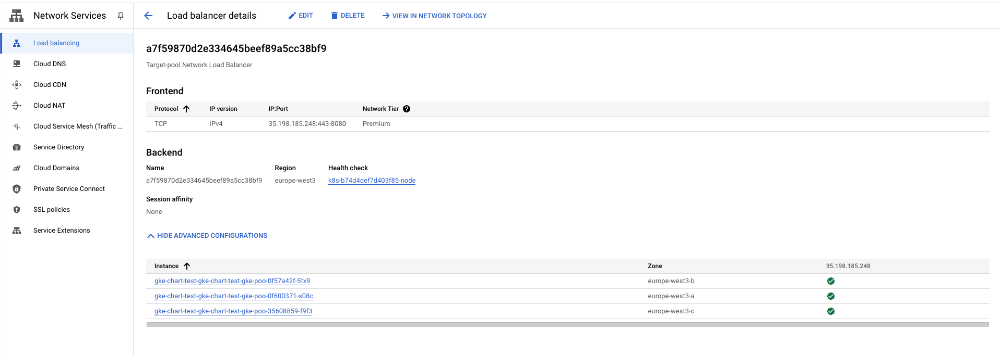

This section configures **Lightrun Router** the **GKE  Service Controller**.
This guide covers set either  [External Network Load Balancer](https://cloud.google.com/load-balancing/docs/tcp) or [Internal Network Load Balancer](https://cloud.google.com/load-balancing/docs/tcp/internal-proxy) based on Kubernetes [Service resources](https://kubernetes.io/docs/concepts/services-networking/service/).
# Prerequisites
1. Ability to create DNS A record points to the GCP Network Load Balancer record.
# Configure the Lightrun Router in the helm chart

##### GCP Network Load Balancer  Non-SSL <> Lightrun Router SSL
   >The GCP Network Load Balancer listens for incoming requests on protocol/port TCP:443 and forwards traffic to the Lightrun router on protocol/port HTTPS:8443.
   >The Lightrun router then performs SSL termination and directs the traffic to Lightrun services within the cluster.

In the "values.yaml" of the lightrun helm chart navigate to "general.router" and ensure at the minimum the following configuration is set:
* general.router.enabled: true
* general.router.tls.enabled: true
* general.router.ingress.enabled: false
* general.router.ingress.ingress_class_name: ""
* general.router.service.enabled: true
* general.router.service.type: LoadBalancer
* general.router.host_port.enabled: false  

As shown in the following example:
```yaml
router:  
  ## general.router.enabled - boolean flag, indicates whether to enable a Router (single entrypoint for Lightrun deployment).  
  enabled: true  
  tls:  
    # If enabled router will expose HTTPS traffic  
    # If internal_tls.enabled is set to true, SSL termination will be enabled regardless of this value    # Has to be enabled when exposed by the host_port
    enabled: true  
  
  ingress:  
    enabled: false  
    ingress_class_name: ""  
    # If your ingress limiting the body size, you can override it with annotation  
    # example for nginx-ingress: "nginx.ingress.kubernetes.io/proxy-body-size": "25m"
    annotations: {}
    labels: {}  
  
  service:  
    enabled: true  
    ## Supported types: ClusterIP, LoadBalancer, NodePort, Headless  
    type: "LoadBalancer"  
    annotations: {}  
    labels: {}  
    ports:  
      http: 8080  
      https: 8443  
  
  ## Only relevant for single-vm use case  
  host_port:  
    # Required to set general.router.tls.enabled to true  
    enabled: false  
    ports:  
      http: 80  
      https: 443
```
The above sample will create External Network Load Balancer, if instead you want to use Internal Network load balancer please add `networking.gke.io/load-balancer-type: "Internal"` annotation into general.router.service.annotations 
# Create a DNS record pointing to GCP Network Load Balancer 

1. fetch the GCP Network Load Balancer external-ip of the lightrun router service by running - ` kubectl get service -n <lightrun_namespace>` for example: 
	```
    NAME                                                  TYPE           CLUSTER-IP     EXTERNAL-IP      PORT(S)                        AGE
    lightrun-tig-router-gcp-3-6-5-tls-backend             ClusterIP      10.16.14.223   <none>           8080/TCP                       106m
    lightrun-tig-router-gcp-3-6-5-tls-frontend            ClusterIP      10.16.14.206   <none>           8080/TCP                       106m
    lightrun-tig-router-gcp-3-6-5-tls-keycloak            ClusterIP      10.16.14.72    <none>           8080/TCP                       106m
    lightrun-tig-router-gcp-3-6-5-tls-keycloak-headless   ClusterIP      None           <none>           7800/TCP                       106m
    lightrun-tig-router-gcp-3-6-5-tls-mysql               ClusterIP      None           <none>           3306/TCP                       106m
    lightrun-tig-router-gcp-3-6-5-tls-redis               ClusterIP      None           <none>           6379/TCP                       106m
    lightrun-tig-router-gcp-3-6-5-tls-router              LoadBalancer   10.16.14.60    35.198.185.248   443:30540/TCP,8080:32346/TCP   106m
    ```
    In the output above, the relevant service is "lightrun-tig-router-gcp-3-6-5-tls-router," which is of type LoadBalancer.  
    If the EXTERNAL-IP is not displayed, it may be due to the Kubernetes Service Controller being unable to configure the Load Balancer on GCP.
    To further investigate, you can check the events related to the lightrun router service object.


2. Based on your DNS provider, create a DNS A record with the record name matching the lightrun endpoint(e.g., "lightrun-tig-router-gcp-tls.internal.lightrun.com") and set it to the EXTERNAL-IP provided in the output (e.g., "35.198.185.248").


# Verification
## Verify Lightrun Router pod is up:

1. run `kubectl get pods -n <lightrun_namespace>` and check the status of the lightrun router pod
	```
    NAME                                                          READY   STATUS    RESTARTS   AGE
    lightrun-tig-router-gcp-3-6-5-tls-backend-79cff8874d-lhdsm    1/1     Running   0          109m
    lightrun-tig-router-gcp-3-6-5-tls-frontend-69f769c478-vlt4g   1/1     Running   0          109m
    lightrun-tig-router-gcp-3-6-5-tls-keycloak-7c4f48b8db-xwxzx   1/1     Running   0          104m
    lightrun-tig-router-gcp-3-6-5-tls-mysql-0                     1/1     Running   0          109m
    lightrun-tig-router-gcp-3-6-5-tls-redis-7fb6574cd5-nrbfk      1/1     Running   0          109m
    lightrun-tig-router-gcp-3-6-5-tls-router-5944bb595-t6rdj      1/1     Running   0          109m

	
	```
 
2. On GCP console check the Network Load Balancer  status:  
